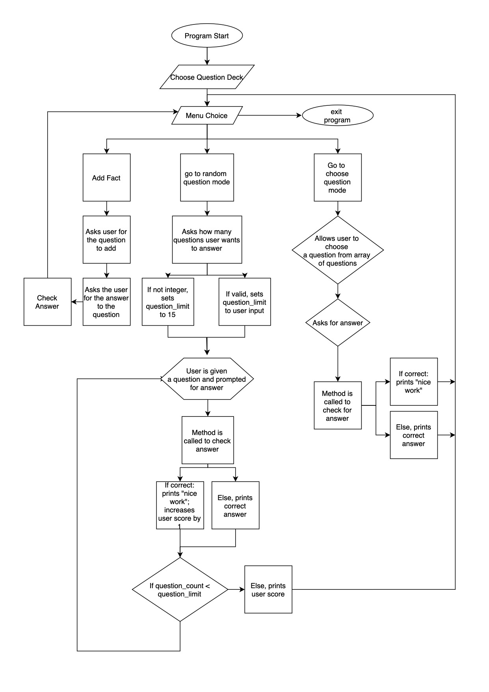

Not much to read here.

### Purpose and Scope
The application is as a flashcard app, very similar to the popular notetaking app *anki*. It allows the user to add, view, and test themselves with questions. It has a few different modes, the most important being a random question testing mode, which scores the users correct responses out of a user defined limit. Each question/answer pair has a built in learning metric, which determines the frequency a particular question is shown to the user. 

If used correctly this terminal app should help the user learn new content through testing. It aims to implement a very naive model of spaced reptition, where those questions that are less well known are asked more frequently, and those where the user scores correctly, are shown less frequently. The target audience is for students, to help content be learned more efficiently. 

The program utilises gems such as tty-prompt and tty-font to make the program more appealing and engaging. It is still very barebones, and much can be done to extend it in the future.

Whne the CLI is launched it will request the user to choose a deck. To which it will proceed to a menu screen, where they can choose between three options. These options are to add a card, test themselves with order dcetrmined by program (combination of learning metric and calls to random), or they can opt to choose the questions to answer individually. The program will not exit unless the "exit" option is chosen in the menu. 

 

### Features
##### Ability to add a question/answer
Users are given an option in the menu to add a question/answer paur to the deck they've chosen. They're prompted for a question, followed by an answer. This calls a function to create a fact object out ofg the given inputs, which initialises other variables such as a learning metric, and add it to the deck with the given inputs. The question/answer pair can then be accessed throughout the rest of the program, and used like any of the other provided facts. It is however lost after the user exits the program.   
 

##### Answer specific facts
This menu choice allows the user to choose a fact out of the deck, answer said fact, and return whether the answer was correct. If the answer is incorrect, the correct answer is displayed. Through this the user can see the questions in the deck, and pick out individual ones that they want to practice and/or are interested in. Note that learning metrics are not effected by this mode, and that user added question/answer pairs can be viewed like any of the other questions. After viewing a card, the user is returned to the menu choice. This feature is good for learning specific content, rather than a semi-randomised flow of questions (which becomes more important as the decks get bigger, )
 

##### Test questions
This is a menu choice that first prompts the user as to how many questions they want to answer. It then proceeds to output a random question from the chosen deck. The deck is filled with Fact objects that each have an initialised variable called "learning metric". This metric is changed slightly according to whether their answer is correct or not. This influences subsequent question order, with those that the user gets correct being shown less freuqently. Once the user inputted question limit is reached, the users score is displayed and they're returned back to the menu screen.  

 

### Control Flow Diagram

### Help/Installation
** gems need to be installed // requires gems
** source code needs to be downloaded (all 3); ensure all are in the saem folder
** run the ruby file "flash_card2_control.rb"

** feel free to add any facts you want in the "arrayOfFacts.rb file
** NOTE: any facts added whilst in the program itself will onlyt be saved in that session, not permanently to the "arrayOfFacts.rb" file. 

### Implementation plan

### User interaction and experience

